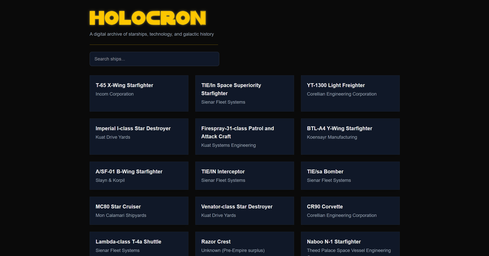

# Holocron

A Star Wars encyclopedia for ships, characters, and planets — built with Next.js, TypeScript, and PostgreSQL.

**[Live Site →](https://holocron-iota.vercel.app/)**



## Tech Stack

- **Framework** — Next.js 16 (App Router)
- **Language** — TypeScript
- **Styling** — Tailwind CSS v4
- **Deployment** — Vercel

## Running Locally

```bash
git clone https://github.com/your-username/Holocron.git
cd Holocron/holocron
npm install
npm run dev
```

Open [http://localhost:3000](http://localhost:3000).
